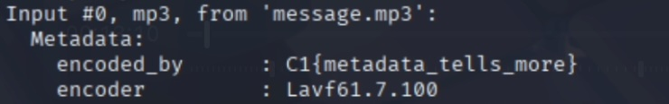

## Behind the beat
## Difficulty: Very Easy
## Tools: [ffprobe](https://docs.tdarr.io/blog/how-to-install-ffprobe-and-gather-data-from-a-media-file/)
## Description:
Agents intercepted an audio file named message.mp3. It plays a single tone, but we have intel that a flag might be tucked away in the metadata fields of the file. Can you inspect the file and uncover the flag?
## Solve:
- After downloading the file, use ```ffprobe``` to inspect its metadata (since ffprobe is installed on my Kali VM, I have to move the file into my VM first). The flag can be seen in the "encoded by" field.
