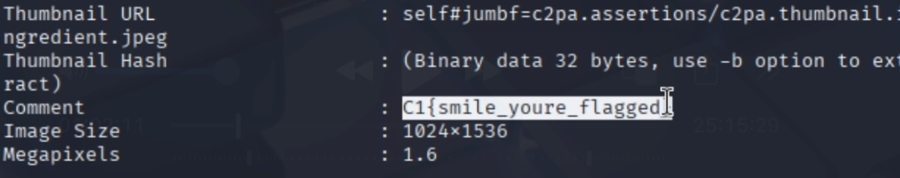

# Hidden in plain sight
## Difficulty: Very Easy
## Tools: [exiftool](https://www.geeksforgeeks.org/installing-and-using-exiftool-on-linux/)
## Description:
Analysts recovered a suspicious image from a threat actor’s social media account. At first glance, it looks like an innocent selfie - but insider reports suggest that a flag might be hiding in the image metadata. Can you extract it?
## Solve:
- After moving the .png file into Kali VM, use ```exiftool <file-name>``` to inspect its metadata and find the flag.
