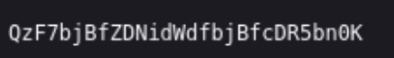
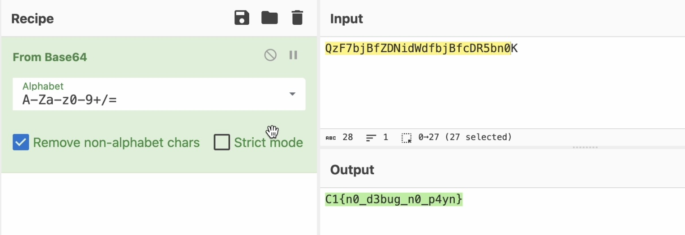

# Encoded Evidence
## Difficulty: Very Easy
## Tools: Browser, [CyberChef](https://cyberchef.org/)
## Description:
We've intercepted a suspicious script file. It appears to be a placeholder for some kind of malware delivery mechanism, but the actual payload seems to be hosted somewhere else. Analysts believe a flag is hidden by this script. Can you locate and decode it?
## Solve:
- This is another very straight-forward challenge. After downloading the file ```invoice.vbs```, the result from ```file``` command indicates it being an ASCII file, which could be opened with ```cat``` command.
- Within the file is an ```URL```, which, when opened in a browser, displayed a short base64 string.

- Decode it with CyberChef got us the flag.
