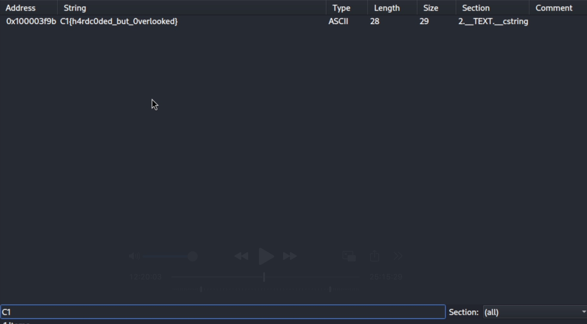

# Hardcoded Lies
## Difficulty: Very Easy
## Tools: [Cutter / Rizin](https://www.kali.org/tools/rizin-cutter/)
## Description:
The malware sample doesn’t appear to print anything useful. But our threat intel team believes it holds a hardcoded configuration string. Can you pull on some strings to retrieve it?
## Solve:
- After downloading and unzipping the file, I tried to read it with ```cat``` command, which output gibberish. Using ```file``` on the unzipped file yielded ```Mach-O 64-bit arm64 executable```. Since it's a binaries, we can use ```Cutter``` to dissemble it.
- In ```Cutter```, after loading the file, I went to String tab and searched for ```C1```, which is the beginning of every flag, and actually found it. That was easy!
