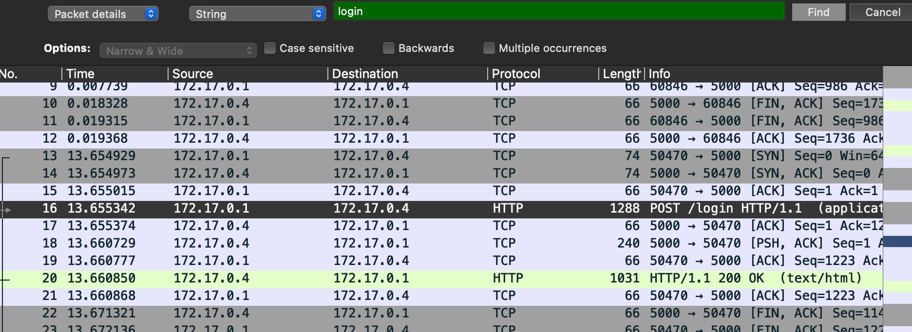
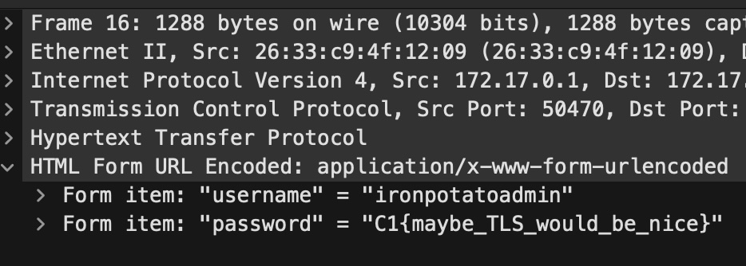

# Packet Whisperer
## Difficulty:Very Easy
## Tools: [Wireshark](https://www.wireshark.org/download.html)
## Description:
Our blue team intercepted a network capture file. It contains unencrypted HTTP traffic. While skimming through it, analysts believe someone accidentally exposed their login credentials in plain text. Review the PCAP to find the password that the user logged in with.
## Solve:
- Opening ```login.pcap``` file in Wireshark reveals a few captured traffic packets. Since we're looking for login credentials, it's likely that the data was submitted to a URL with the word "login" in it (e.g /login.php, /login, /login.html). So we use string-search function of Wireshark to look for keyword "login".
- In the second result we see a POST method submitted to /login, which is very likely what's we're looking for.

- In the bottom-left corner of Wireshark screen, we can inspect the packet further and see the data in the submitted form. The flag is found in the password field.
