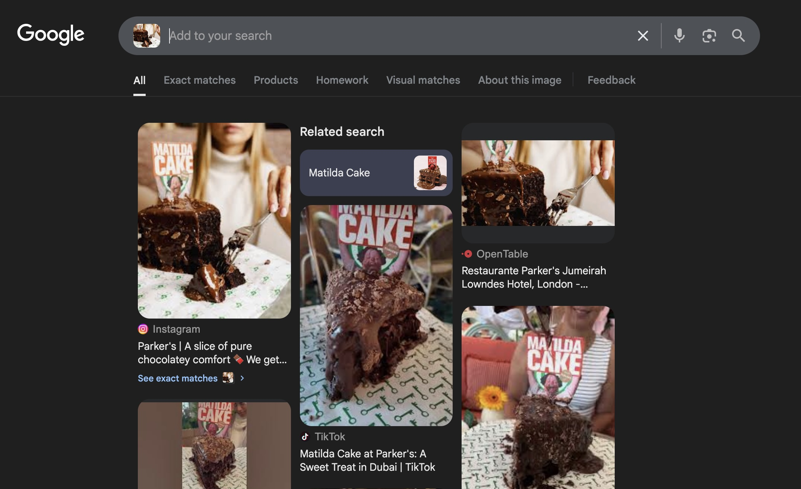
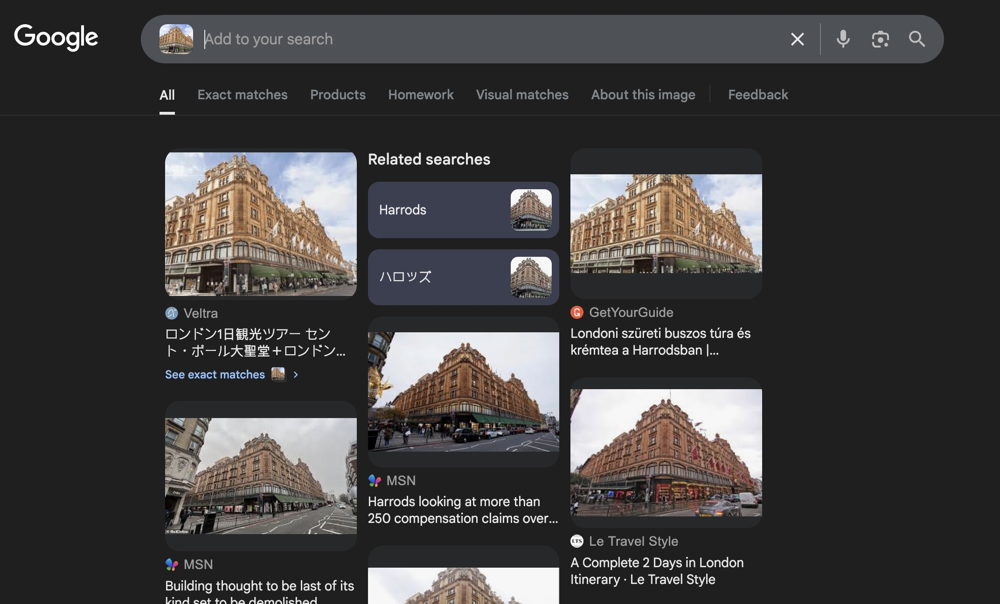
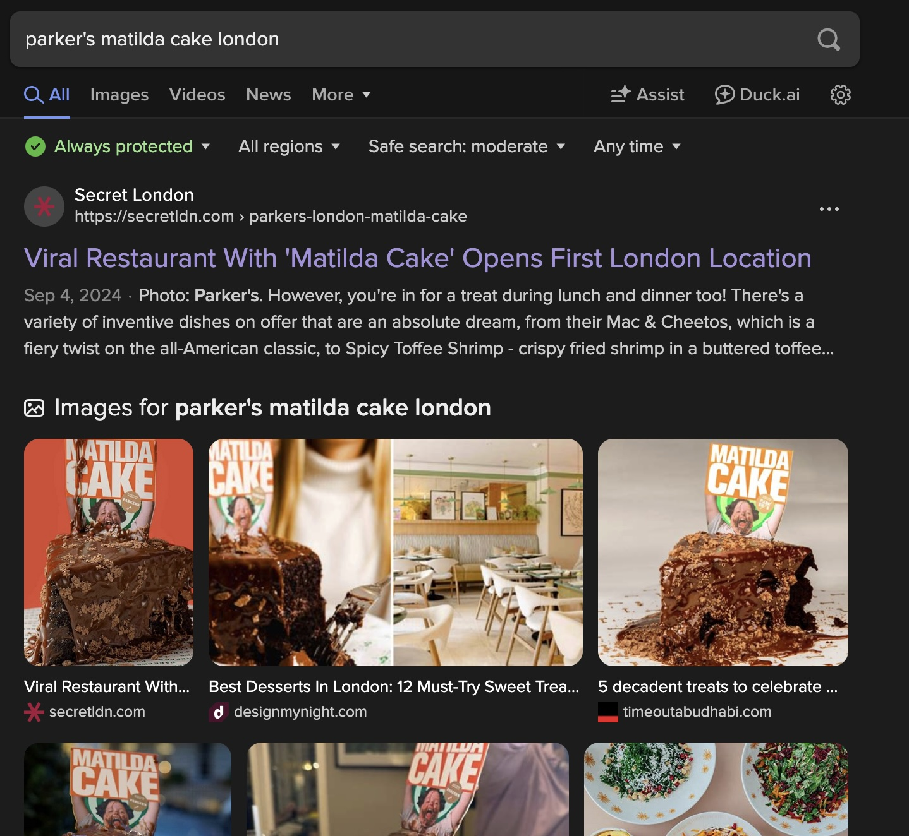

# Cafe Confidential
## Difficulty: Very Easy
## Tools: [Google Reverse Image Search](https://images.google.com/)
## Description:
Two photos were posted minutes apart by someone of interest. One shows them enjoying a slice of cake in a boutique café; the other captures a well-known landmark in the background. We believe both photos were taken on the same outing. Can you determine exactly which café they visited, and where is it?
Flag format is: C1{Cafe Name_Street Name}
For example, Tom's Cafe located at 31 Mitchell Rd, Boston, MA would be C1{Tom's_Mitchell}.
## Solve:
- After downloading the two images, we see that one is the image of a slice of cake, and another depicts a building. I tried to use ```file``` and ```exiftool``` on the images to check on their metadata, see if I could find a geographic coordinates or any valueable information, but there was nothing interesting to be found.
- Using Google Image Search on the first picture yields many articles, tiktoks and youtube videos of Matilda's Cake sold at Parker's, a cake shop in Dubai. We have our first half of the flag: ```C1{Parker's_```

- Reverse image searching the second picture, we can see that the building is Harrods, a famous department store in London.

- The two pictures were supposedly taken on the same outing, so how can the first picture is of a cake in Dubai, while the second is a building in London? Unless the photographer can teleport, there must be another Harrods in Dubai, or another Parker's in London.
- There is no Harrods in Dubai, but the Parker's cake shop do have a branch in London!

- Reading through the article, we can find the location of the branch at "Jumeriah Lowndes Hotel 21 Lowndes St, London SW1X 9E". We have our complete flag: ```C1{Parker's_Lowndes}```


