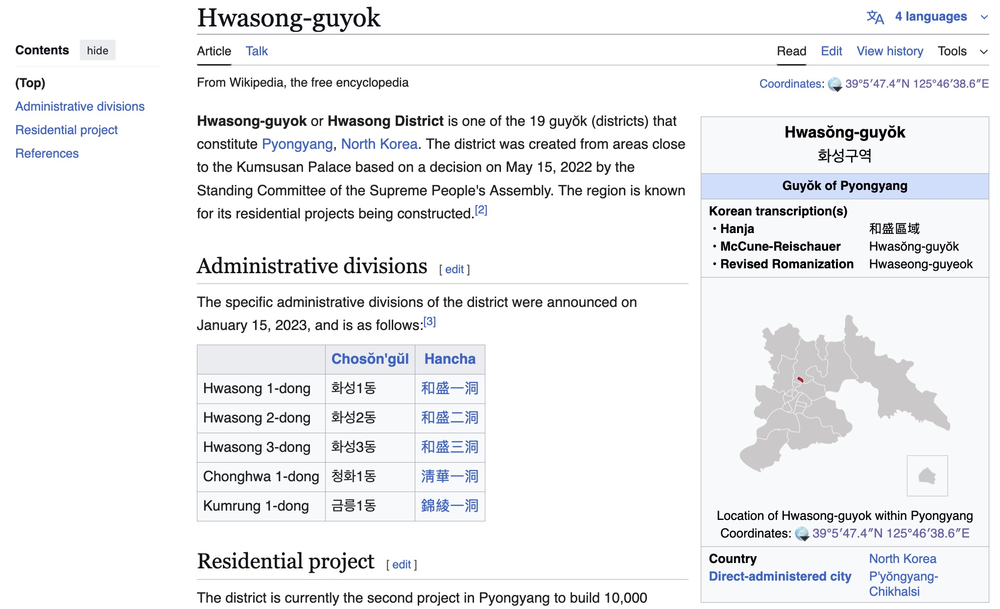
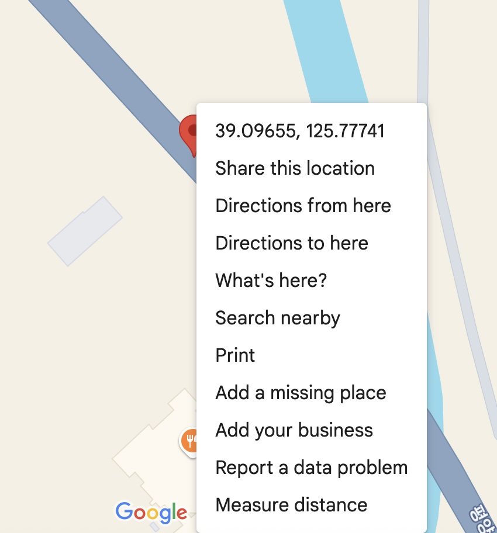

# Inspo
## Difficulty: Medium
## Tools: Google Reverse Image Search, Google Maps
## Description:
We believe that the North Torbians are heavily influenced by North Korean developments and wish to match them. We have suspicions that Juche Jaguar will try to build out similar spaces to ones in these pictures. Can you find the coordinates of where these pictures were taken?
The flag is any valid decimal degree coordinate notation within a 500m radius of the building. The flag is in the following format: C1{XX.XXX,XX.XXX}
For example, the White House would be at decimal degree notion of 38.897, -77.036. The flag for the White House would be: C1{38.897,-77.036}
Note that this flag is a regex match for any valid coordinate within the 500m radius.
## Solve:
The thing about OSINT, and perhaps a lot of other challenges, is that there are lots of ways to solve it. Different people may have different approaches and different resources, using different tools. In this writeup is how I arrive at my solution, but it is in no way the only solution. 
- After downloading the two images, I first reverse-searched the computer club picture. There were a lot of results from social media sites. I tend to steer clear from social networks since they are dens of misinformation, and any legit information is sourced from news sites, which are what I was looking for anyway.

- After digging around in ```Exact Matchces``` and ```About this Image``` tabs, I found an interesting article: [link](https://www.nknews.org/2025/04/kim-jong-un-vows-cars-and-gaming-for-core-citizens-but-whats-behind-the-pitch/) Within the article, not only there was the computer club picture that I reverse-searched, the second picture was also there.
- Reading through the article, I found that the pictures were taken during a visit to the newest skyscrapper housing project in Hwasong, Northern Pyongyang, North Korea.
- Googling ```Hwasong northern Pyongyang North Korea``` yielded a wiki site that conveniently included coordinates.

- You can use a calculator to convert ```39°5′47.4″N 125°46′38.6″E``` to {XX.XXX, XX.XXX} format, or paste the location into Google Maps and right-click on the location. The flag would be ```C1{39.096,125.777}```
