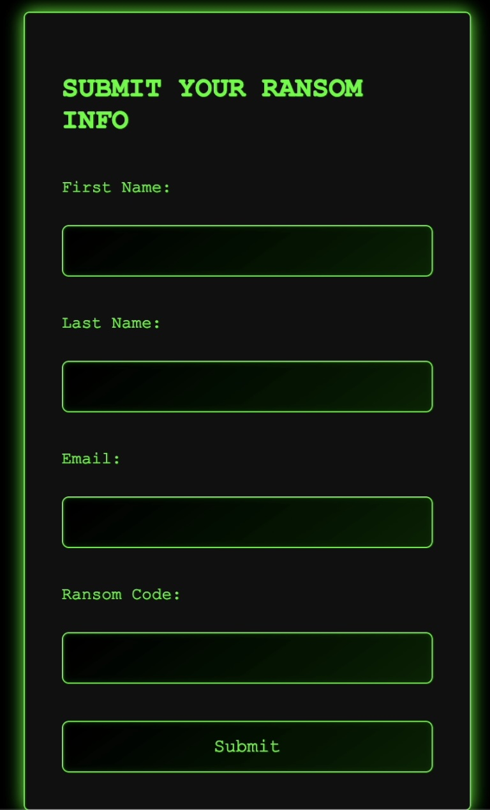
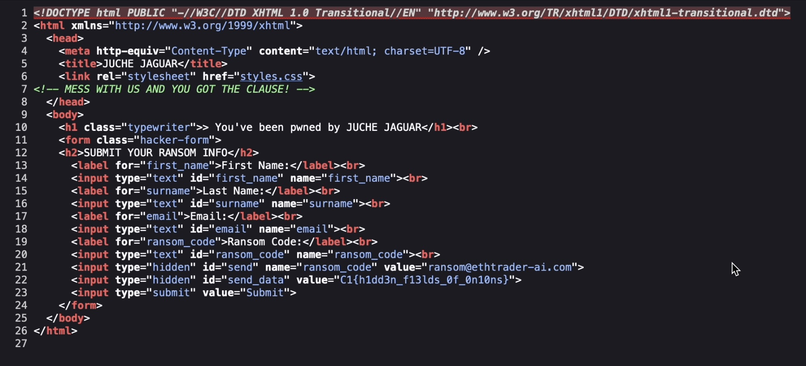

# Problem in North TORbia
## Difficulty: Easy
## Tools: [TOR Browser](https://www.torproject.org/download/)
## Description:
We were given a ransom note but none of our files were encrypted. Regardless, could you run it back and see what information could be gleaned from it?
## Solve:
- After downloading ```note.txt```, using file on it didn't yield any interesting result. Opening the file, we can see the ONION link ```http://jjpwn5u6ozdmxjurfitt42hns3qovikeyhocx5b2byoxgupnuzd2vkid.onion/``` where we are told to send the payment to.
- When we uses TOR browser to access the link, there is a single payment form on the website.

- I had the urge to try a code injection payload when seeing the form, but first, let's view the page source and see if we can find any clues. And the flag is right there, in hidden input field with id="send_data"

