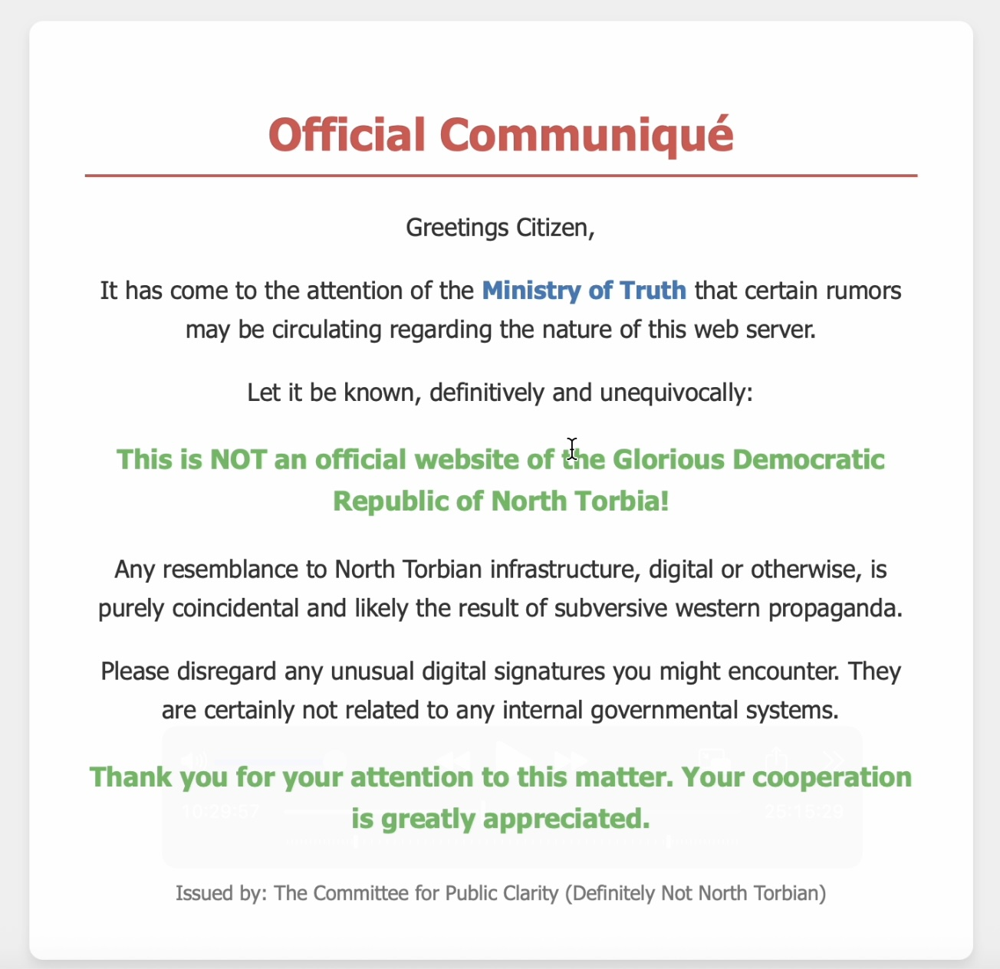

# Hoasted Toasted
## Difficulty: Easy
## Tools: Browser (Firefox), [dig](https://www.geeksforgeeks.org/linux-unix/dig-command-in-linux-with-examples/), curl
## Description:
We have discovered what we believe is a North Torbian public website and have suspicions there is a secret internal-only site hidden there as well. Figure out how to connect to the hidden site and find the flag!
The site is at http://not-torbian.ethtrader-ai.com/
## Solve:
When doing recon on websites, I prefer to do passive recon first, since active recon with tools such as nmap, gobuster, etc. could be intrusive.

- I started with inspecting the elements of the page, but couldn't find any hidden or interesting information.
- Next, I appended ```/robots.txt``` to the URL, but only got ```404``` in return. I also tried common words like ```/admin, /index, /images, /scripts, etc``` but they all returned ```404```
- At this point, I was ready to emunate directories, looking up ```ffuf``` syntax and word lists, but there was still one last trick I could try. I checked the SSL certificate, and found an exciting clue.

- However, accessing ```definitelynotaflag.north.torbia``` directly with a browser didn't work, as the site couldn't be found. The flag was definitely within the site, but I needed to find the correct way to access it.
- It took me over an hour of googling, asking ChatGPT, trying and failing, until I found a solution that works:
    - ```dig +short http://not-torbian.ethtrader-ai.com/``` gave me ```34.86.60.228```
    - ```curl -k -H "Host: definitelynotaflag.north.torbia" https://34.86.60.228``` returned a lengthy HTML page, at the bottom of which I found the flag
    
    - Apparently, ```definitelynotaflag.north.torbia``` and ```not-torbian.ethtrader-ai.com``` are virtual hosts that shared the same IP address, which was heavily implied when they were both listed as DNS Names under Subject Alt Names within the Digital Certificate.
    - ```definitelynotaflag.north.torbia``` were not publicly listed, therefore the URL could not be resolved into an IP address, but ```not-torbian.ethtrader-ai.com``` was. As such, the ```curl``` command with Host header helped me access the private vhost through the public vhost.
- This is an interesting challenge that raises the concern about security risks when hosting internal sites without proper access control of critical servers.