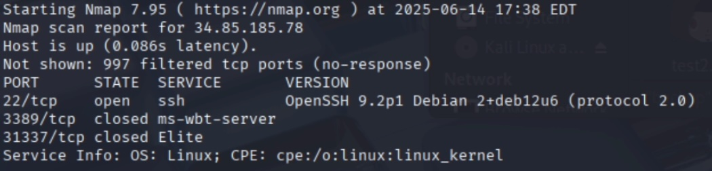
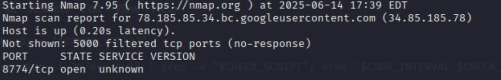
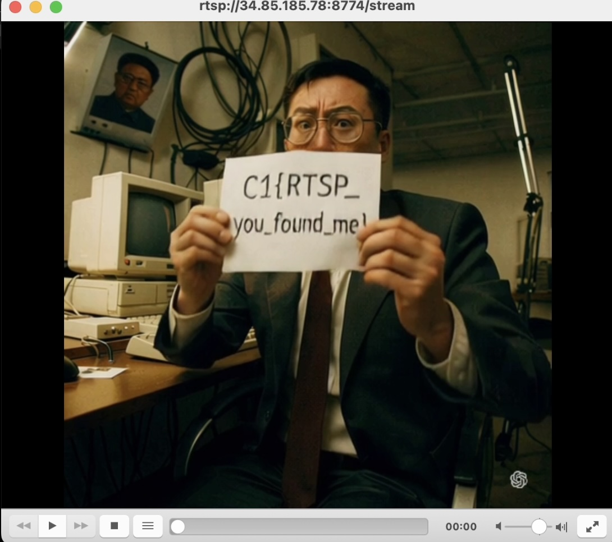

# Screamin' Streaming
## Difficulty: Medium
## Tools: [nmap](https://www.kali.org/tools/nmap/), [ffprobe](https://docs.tdarr.io/blog/how-to-install-ffprobe-and-gather-data-from-a-media-file/), [VLC Media Player](https://www.videolan.org/vlc/)
## Description:
We've received intel that Juche Jaguar has exposed a network stream on the host 34.85.185.78 between TCP ports 5000 and 10000. Once you find the port, connect to the correct stream name and report back with a flag.
Find the network stream and get the flag!
## Solve:
- The challenge was described in a way that made you immediately think of ```nmap``` port scanning.
- First, I used command ```nmap -sS -sV 34.85.185.78```, which ouput 3 ports: 22, 3389 and 31337, none of which was within the range 5000-10000 that was required.

- After digging around the Internet, I came to understand that when ```nmap``` is used without specifying the port or port range, the default 1000 ports, which are usually the most common ones. It seemed that the port I needed to find was not one of the most common 1000 TCP ports.
- Then I tried specifying the port range in the nmap command: ```nmap -sV 34.85.185.78 -p 5000-10000```. It took quite some time, about 10-15 minutes for the scanning to finish, but it found the right port 8774.

- I was stuck at this point as I didn't know how to connect to the stream. After an hour of checking the Internet with little to show for, I purchased the hint: ```The open port uses RTSP. Once the port is found, you will need the correct stream name. You will need to emunate the stream name through some type of brute forcing. Use tools like ffprobe to help find the correct stream name in order to connect to it with a tool such as VLC```
- I emunated stream names with command ```ffprobe rtsp://34.85.185.78/<stream-name>``` and tried various names like juche-jaguar, supremeleader, juche, jaguar, northtorbia, etc, all of which yielded 404 error code, until I tried ```ffprobe rtsp://34.85.185.78/stream```, which resulted in a hanging cursor.
- That must be the right link. I connected to the RTSP link and found the flag in a looping video.
