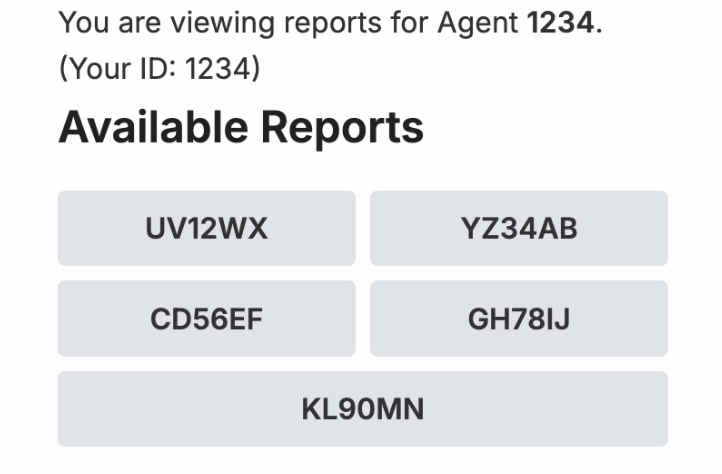
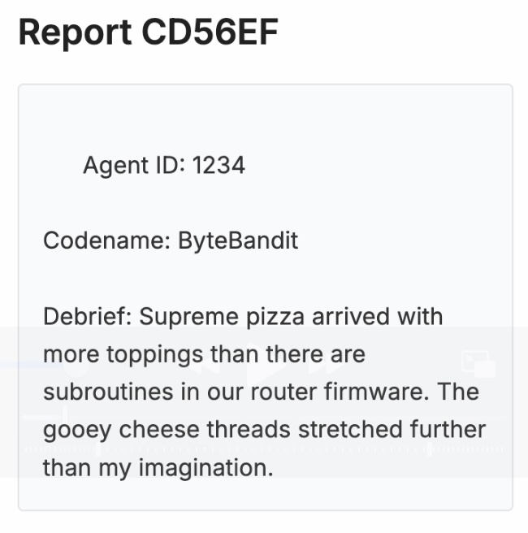
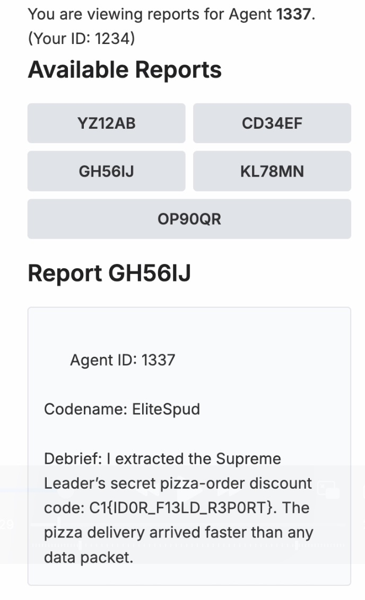

# Field Reports Mayhem
## Difficulty: Easy
## Tools: Browser (Firefox)
## Description:
We've gained access to the Juche Jaguar’s Field Reports archive through an operative's use of weak credentials. Upon logging in, the operative sees their previous field reports and can file new ones. Somewhere in here, I am sure some 'leet' agent stashed the Supreme Leader's secret pizza discount code!
Use the credentials: ```1234:spudpotato```
## Solve:
- First, we go to the website and use the provided credentials to log in. This will lead us to the homepage where we can find the reports.

- Clicking and reading through the reports, we notice that content of report CD56EF is about the supreme pizza. Since the flag we're searching for is supposedly a secret pizza discount code, this might be important later on

- Noticing how the URL of the page ```http://<IP-address>/dashboard.php?id=1234&code=CD56EF``` has id=1234, which is the id we used to login, and code=CD56EF, which is the report we're reading. This means the PHP page take inputs through URL parameters. So we might be able to access other agent's homepage if we change the id parameter.
- The key lies in the word 'leet' in the challenge's description, referencing . "leet" is translated through leet speak into 1337.
- Change the id parameter in the URL to 1337, we will have access to new reports. Click on the GH56IJ report, which is in the position of CD56EF report previously, and we can find the flag.
 