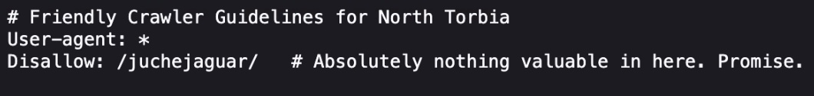
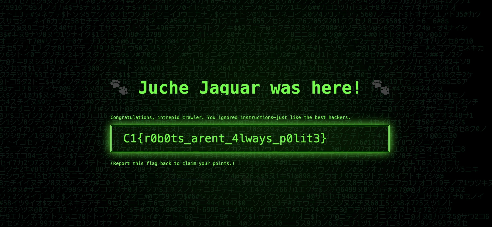

# Secret.txt Society
## Difficulty: Very Easy
## Tools: Browser
## Description:
Our team suspects that a Juche Jaguar developer accidentally left something interesting behind on a public site. You’ve been tasked with examining its structure. Can you uncover what the bots were told to ignore? Start with the usual entry points a crawler might explore. One disallowed path leads to a page where someone left behind more than just code.
## Solve:
- Go to the provided website
- Append "/robots.txt" at the end of the url, this will lead you to the  file of the website, which displays:
    ```Disallow: /juchejaguar/ # Absolute nothing valueable in here. Promise.```
- Obviously, there is something valuable in /juchejaguar/. We append /juchejaguar/ to the original url, which will lead us to the site with .

Learn more about 